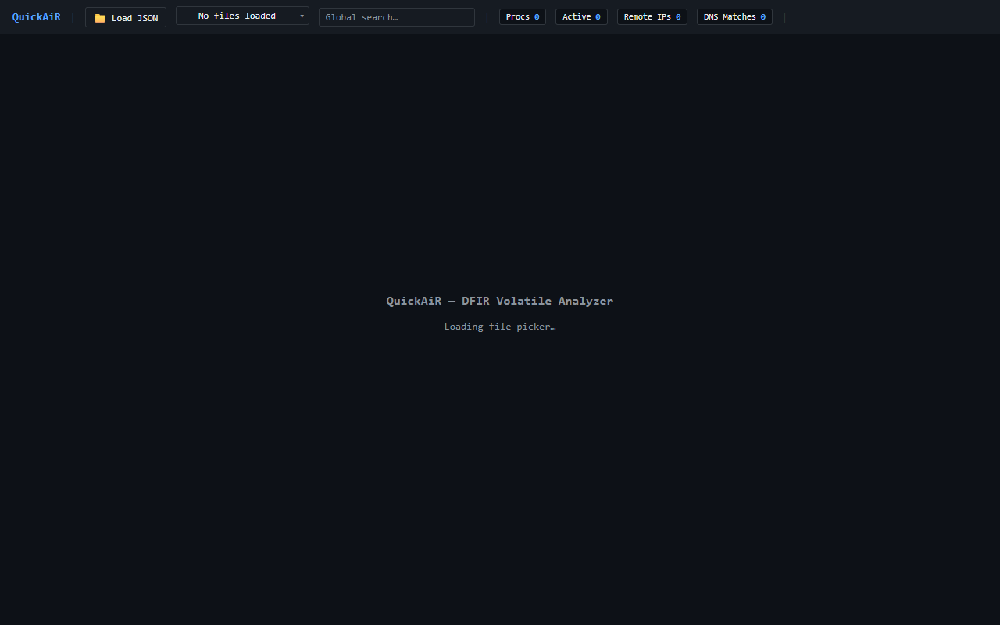
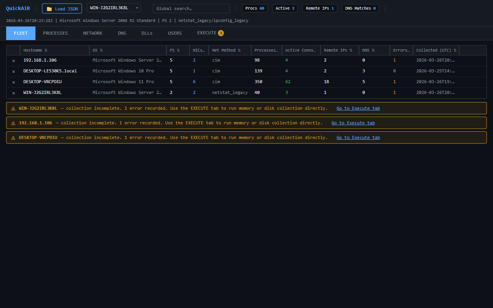
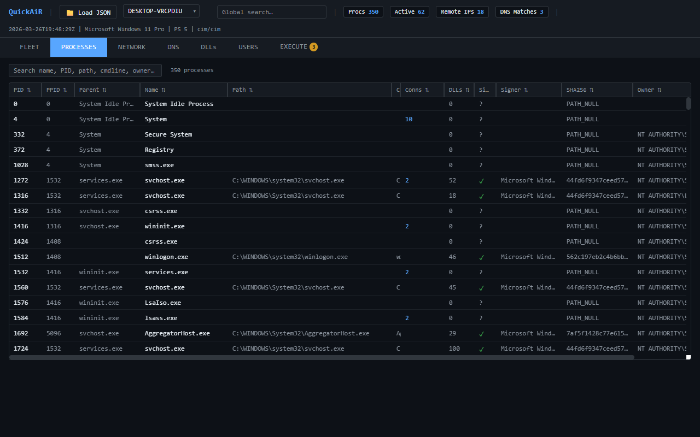
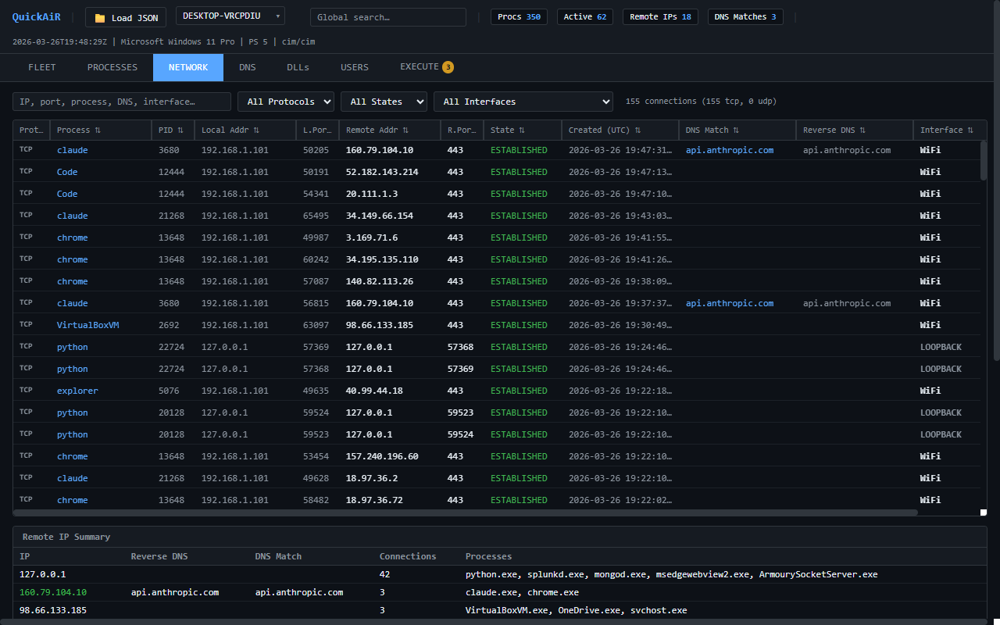
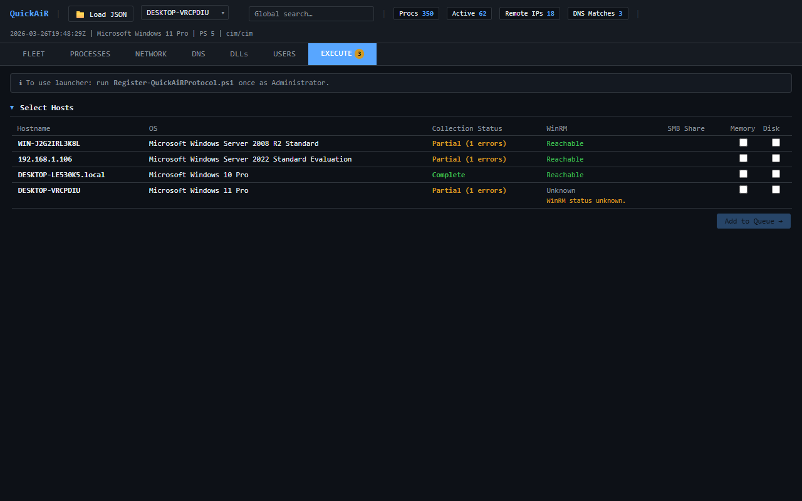

<p align="center">
  
</p>

<h1 align="center">QuickAiR</h1>

<p align="center">
  <em>DFIR volatile artifact collector for Windows environments</em>
</p>

QuickAiR collects process list, active network connections, and DNS cache from local or remote Windows machines via WinRM. Output is a single JSON file per host, visualized in an offline single-file HTML investigation GUI.

---

## Features

- Collects: processes, TCP connections, DNS cache
- Single JSON output per host
- Offline HTML GUI with multi-host fleet view
- Process → network → DNS cross-correlation
- PowerShell 2.0 through 5.1 target support
- No external dependencies, no internet required
- Domain and workgroup environments

---

## Requirements

**Analyst machine:**
- PowerShell 5.1
- Run as Administrator
- WinRM access to targets

**Target machines:**
- WinRM enabled
- PowerShell 2.0 minimum

---

## Quick Start

```powershell
# Collect from localhost
.\Collector.ps1 -Targets localhost

# Collect from remote host
.\Collector.ps1 -Targets 192.168.1.10 -Credential (Get-Credential)

# Collect from multiple hosts
.\Collector.ps1 -Targets 192.168.1.10,192.168.1.11,192.168.1.12 `
  -Credential (Get-Credential) -OutputPath C:\Cases\Case001\

# Open GUI
# Open Report.html in browser
# Click Load JSON or drag and drop host JSON files
```

---

## User Guide

### Step 1 — Collect artifacts

Run the collector from an elevated PowerShell prompt:

```powershell
# Single host
.\Collector.ps1 -Targets 192.168.1.10 -Credential (Get-Credential)

# Multiple hosts
.\Collector.ps1 -Targets 192.168.1.10,192.168.1.11 -Credential (Get-Credential)
```

One JSON file per host is saved to `.\DFIROutput\`.

### Step 2 — Open the report

Open `Report.html` in any browser. No server needed — it works completely offline.



Click **Load JSON** (or drag-and-drop files) to load your collected JSON files.

### Step 3 — Fleet overview

The **Fleet** tab shows all loaded hosts at a glance: OS, PowerShell version, process count, active connections, and collection errors.



Click any host row to switch to that host's data. Warning banners highlight hosts with collection errors.

### Step 4 — Investigate processes

The **Processes** tab lists every running process with PID, parent, path, command line, DLL count, signature status, SHA256, owner, and integrity level.



Use the search bar to filter by name, PID, path, or command line. Click a process row to see its network connections.

### Step 5 — Investigate network connections

The **Network** tab shows all TCP/UDP connections with process correlation, DNS matches, timestamps, and interface assignment.



Filter by protocol, state, or interface. The **Remote IP Summary** at the bottom groups connections by destination.

### Step 6 — Launch remote tools

The **Execute** tab lets you dispatch memory and disk collection tools to hosts directly from the report.



Select hosts, check Memory/Disk, click **Add to Queue**, then **Launch All**. Requires one-time setup with `Register-QuickAiRProtocol.ps1`.

---

## Usage

**Parameters:**

| Parameter | Required | Description |
|-----------|----------|-------------|
| `-Targets` | Yes | One or more hostnames or IPs |
| `-Credential` | No | PSCredential. Not required for localhost |
| `-OutputPath` | No | Output folder. Default: `.\DFIROutput\` |
| `-Quiet` | No | Suppress console output |
| `-Help` | No | Show help and exit |

---

## Output

One JSON file per host:

```
<OutputPath>\<hostname>\<hostname>_<timestamp>.json
```

JSON structure:

| Key | Contents |
|-----|----------|
| `manifest` | Collection metadata, versions, errors |
| `processes` | Full process list with parent-child links |
| `network_tcp` | TCP connections with process correlation |
| `dns_cache` | DNS cache with connection cross-reference |

---

## GUI — Report.html

Open in any modern browser. Fully offline. No server needed.

**Tabs:**

| Tab | Description |
|-----|-------------|
| Fleet | All loaded hosts summary, switch active host |
| Processes | Full process list with network pivot |
| Network | All TCP connections with process pivot |
| DNS | DNS cache with connection correlation |

**Features:**
- Load multiple host JSONs simultaneously
- Drag and drop JSON files onto page
- Global search across all tabs
- Cross-reference: process → connections → DNS
- Virtual scroll — handles large datasets

---

## Collection Tiers

| PS Version | Process Source | Network Source | DNS Source |
|------------|----------------|----------------|------------|
| PS 5.1 | CIM | CIM (MSFT_Net\*) | CIM (MSFT_DNS\*) |
| PS 3–4 | CIM | netstat fallback | ipconfig fallback |
| PS 2.0 | WMI | cmd netstat | cmd ipconfig |

---

## Supported Targets

- Windows 10 / 11
- Windows Server 2008 R2
- Windows Server 2012 R2
- Windows Server 2016 / 2019 / 2022
- Domain and workgroup environments
- Domain Controllers

---

## Limitations

- PS 2.0 and PS 3–4 collection paths are best-effort (tested on PS 5.1 only)
- Process list is a point-in-time snapshot
- Short-lived processes may not be captured
- EOL systems (2008 R2, 2012 R2) — connect carefully, these are unpatched systems

---

## Testing

Run the included test suite against any collected JSON:

```powershell
.\TestSuite.ps1 -JsonPath <path to host JSON>
```

11 automated checks covering:
- Process completeness, field integrity
- Network completeness, process assignment
- DNS completeness, correlation accuracy
- Manifest integrity, HTML field coverage

---

## Remote Execution (QuickAiR Launcher)

### One-Time Setup

Run as Administrator:

```powershell
.\Register-QuickAiRProtocol.ps1
```

### Usage

1. Open Report.html in browser
2. Load collected JSON files
3. Go to EXECUTE tab
4. Select hosts and collection types
5. Click [Add to Queue →]
6. Review queue preview
7. Click [Launch All →]
8. QuickAiRLaunch.ps1 opens automatically
9. Monitor job progress in launcher window

### Bulk Collection Example

```
Select 5 hosts → Memory only → Launch All
Select 3 hosts → Disk only → Add to existing queue
Select 2 hosts → Memory + Disk → Add to queue
All 15 jobs run with max 5 concurrent
```

### Unregister

```powershell
.\Register-QuickAiRProtocol.ps1 -Unregister
```

---

## Author

DFIR analyst tool — built for incident response workflows.

https://github.com/idogat/quickair
